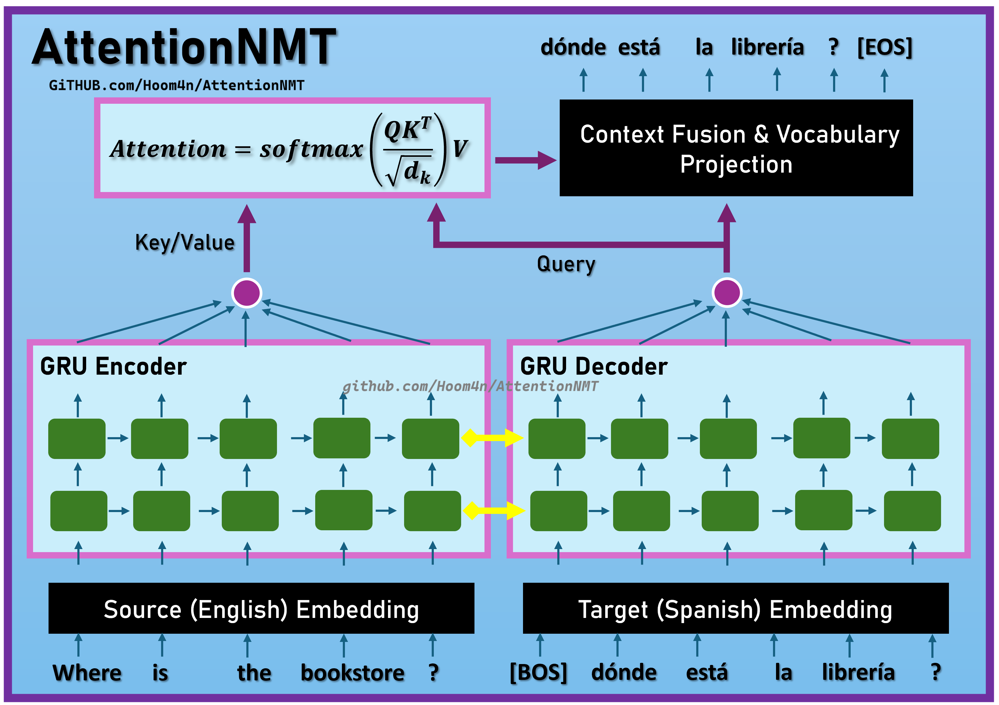

# AttentionNMT🌐


Welcome to AttentionNMT! This project implements an English → Spanish Neural Machine Translation system in PyTorch, built on a GRU‑based Encoder–Decoder architecture with Attention.

## ✨Key Features
* 🧠 **Attention Mechanism**: Dynamically focuses on relevant parts of the source sequence at each decoding step, boosting fluency and handling long‑range dependencies with ease.
* ⚙️ **GRU Encoder–Decoder**: A compact 2‑layer GRU backbone handles both encoding and decoding, delivering strong translation quality without the overhead of heavier architectures.
* 🎯 **Flexible Trainer**: Custom training loop with Mixed Precision, Gradient Clipping, Learning‑Rate Scheduling, Early Stopping, and best‑model restoration — built for stability and speed.
* 🔤 **BPE Tokenizer**: Custom Byte‑Pair Encoding tokenizer with normalization, truncation, and padding ensures clean bilingual text processing and consistent batching.
* 📦 **Reproducible Workflow**: End‑to‑end pipeline with saved artifacts, modular components, and a single notebook walkthrough for transparent, reproducible experiments.


<p align="center">
  
</p>


## 📦 Installation & Explore

### **📒 Explore the Code**  
All steps—data preparation, tokenization, modeling, and training—are documented in a comprehensive Jupyter Notebook: 
👉 [AttentionNMT Notebook](https://github.com/Hoom4n/AttentionNMT/blob/main/AttentionNMT.ipynb)  

### **🚀 Live Demo**  
You can test the translation model live on Hugging Face Spaces:
👉 [Hugging Face Demo 🤗](https://hoom4n-attentionnmt.hf.space/)  

### 🐳 Run with Docker  
```bash
git clone https://github.com/hoom4n/AttentionNMT.git
cd AttentionNMT
docker compose up --build   # first run
docker compose up           # subsequent runs
```  

### 💻 Run Locally  
```bash
git clone https://github.com/hoom4n/AttentionNMT.git
cd AttentionNMT

python3 -m venv venv
source venv/bin/activate

pip install -r requirements.txt
python app.py
```  

## ⚙️ Training Setup  

- **📚 Dataset**: I used about 220k English–Spanish pairs from the [Tatoeba Translation Challenge](https://huggingface.co/datasets/Helsinki-NLP/tatoeba_mt) by Helsinki NLP, specifically the prepared sample curated by [Aurélien Géron](https://huggingface.co/ageron).

- **🔤 Tokenization**: For tokenization I trained a Byte‑Pair Encoding (BPE) tokenizer using Hugging Face `tokenizers`. BPE is the standard choice for NMT because it handles out‑of‑vocabulary words by breaking them into subwords, and a joint tokenizer across English and Spanish lets the model share subword units between both languages. I built the preprocessing directly into the tokenizer’s normalizers pipeline so training and inference always see the same data. That included Unicode normalization (for example, collapsing `á` and `á` into one form), removing strange characters, and lowercasing everything. I set the vocab size to 14,000, which is sufficient for subword tokenization. Since 95% of source and target sentences were under 16 tokens, I truncated to a max length of 32 — this saves a lot of VRAM and compute.

- **🧠 Model** : I implemented a scaled dot‑product attention module to really get intuition for how attention works. It uses the same √dₖ scaling as in the original paper and supports masking. Because encoder outputs include padding tokens, I assign very large negative values to those positions so their softmax weights go to near zero, effectively ignoring them. This attention module sits on top of a GRU encoder–decoder backbone.

- **🎯 Trainer** : For training I built a feature‑rich trainer, an improved version of the one I used in [SentiNet](https://github.com/Hoom4n/SentiNet/). This version adds mixed precision, which nearly halves VRAM usage and speeds up training, and gradient clipping to tame the infamous exploding gradients in RNNs. It also supports early stopping, best‑model restoration, schedulers, and tqdm progress bars. I plan to release it as part of my `hoomanmltk` package on PyPI.

| Component        | Setup                                                                 |
|------------------|----------------------------------------------------------------------|
| **Optimizer**    | Nesterov Adam with learning rate (1e‑3) - gradient clipping (max norm 1.0) - batch size (64) |
| **Regularization** | Weight decay (3e‑5) - GRU dropout (0.1)                          |
| **Model Architecture** | Embedding Dim (512) - Hidden Dim (512), Encoder and Decoder each with 2 GRU layers |
| **Tokenizer**    | BPE with 14K vocabulary size, truncated to 32 tokens, dynamic padding |

## 📊 Results
Training was run for 15 epochs, during which both training and validation losses steadily decreased. The model shows some sensitivity to different punctuation marks in the source text, since the dataset intentionally includes them to help the model recognize sentence types (e.g., questions with “?”, exclamations with “!”, or statements ending with “.”). Below I’ve included a few examples translated by AttentionNMT, and then passed those translations through Google Translate to see how closely they align with the original source text.

| **Sample (English)** | **AttentionNMT Translation (Spanish)** | **Google Back‑Translation (English)** |
|-----------------------|---------------------------------|--------------------------------|
| The capital of France is Paris, often called the city of light. It is famous for its history, architecture and vibrant culture. | la capital de francia es parís , a menudo llamado la ciudad de la luz . es famoso por su historia , arquite ctura y vi br ura . | The capital of France is Paris, often called the City of Light. It is famous for its history, architecture, and vibrant atmosphere. |
| I like playing soccer and listening to music all the time. | me gusta jugar al fútbol y escuchó música todo el tiempo . | I like to play football and I listen to music all the time. |
| Hello, how are you today my friend? | buenos , ¿ cómo estás hoy amigo ? | Hello, how are you today, friend? |
| I was amazed by how the Japanese people built this many years ago. It is truly astonishing! | ¡ estaba sorprendido de cómo que la gente japonesa se constru ye de muchas años atrás ! es muy sorprendente . | I was amazed at how Japanese people have been building things for so many years! It's truly amazing. |
| After months of hard work, she finally saw the light at the end of the tunnel and felt hopeful again. | después de meses de trabajo , finalmente vio al principio . | After months of work, he finally saw the beginning. |

## 🔮 Inference
Running inference with this model isn’t as straightforward as it might seem. During training I used **Teacher Forcing**, which is a technique where the true target token from the previous step is fed into the decoder as input for the current step. At inference time, however, we don’t have access to the ground‑truth translations, so the decoder instead consumes its own output from the previous timestep as the next input.

I implemented a `translate` function in the `src.inference` directory. It takes a source sentence, encodes it, and starts decoding with the [BOS] token. The first predicted token is then appended to the decoder input, and the process continues autoregressively until either an [EOS] token is produced or a predefined maximum length is reached.

For larger models, it’s usually more efficient to compute the encoder representation once and reuse it inside the decoding loop. Since AttentionNMT is lightweight and inference is already fast, I opted for the simpler approach described above.

Currently, the next token is selected greedily, which is generally preferred for translation systems. I also added an alternative sampling mode with a configurable temperature parameter, which you can experiment with yourself.

## 📝 To‑Do
- Implement Beam Search to improve translation quality with the already trained model.
- RNNs were fun companions on my NLP journey so far… but I believe **ATTENTION IS ALL I NEED** for salvation! ⚡
